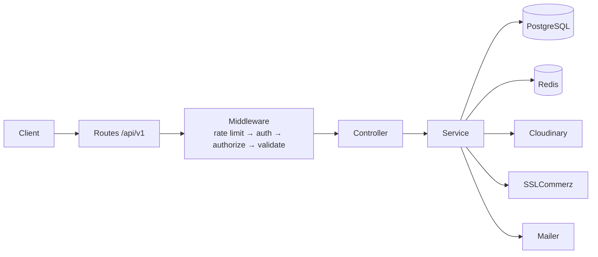
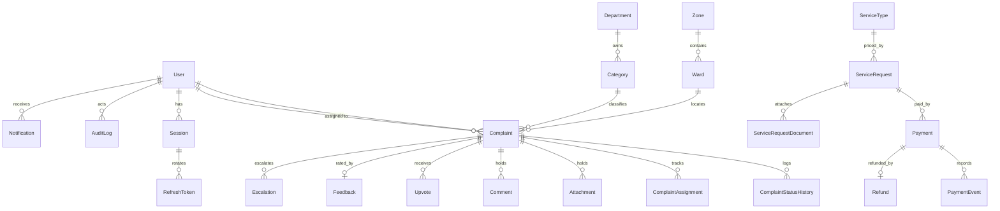

# CityCare Backend

A production-grade REST API for a city complaint and service platform. Citizens report
problems (potholes, garbage, streetlights, waterlogging), field officers resolve the ones
assigned to them, and admins run the system. Paid municipal services are applied for and
paid online.

**Stack:** Node.js 22 · TypeScript (strict, ESM) · Express 5 · Prisma 7 · PostgreSQL · Redis ·
Zod 4 · SSLCommerz · Cloudinary · Vitest

---

## Contents

- [Quick start](#quick-start)
- [Demo credentials](#demo-credentials)
- [Scripts](#scripts)
- [Environment variables](#environment-variables)
- [Architecture](#architecture)
- [Data model](#data-model)
- [Folder structure](#folder-structure)
- [API](#api)
- [Security](#security)
- [Background jobs](#background-jobs)
- [Testing](#testing)
- [Deployment](#deployment)
- [Known limitations](#known-limitations)

---

## Quick start

```bash
pnpm install                 # install dependencies
cp .env.example .env         # then fill in the values (see the table below)

pnpm exec prisma generate    # generate the typed client into src/generated/prisma
pnpm run db:migrate          # create the schema + constraints
pnpm run db:seed             # demo data: users, wards, categories, 20 complaints

pnpm run dev                 # http://localhost:5000
```

Verify it is up:

```bash
curl http://localhost:5000/health   # {"success":true,"message":"OK","data":{"uptime":...}}
curl http://localhost:5000/ready    # also pings Postgres and Redis
```

You need a PostgreSQL database and a Redis instance. Both have generous free tiers
(Neon or Supabase for Postgres, Upstash for Redis). Redis is a *soft* dependency: if it is
down the API keeps serving, only caching and the OTP flows degrade.

There is no Docker setup in this repository — everything runs directly with `pnpm`.

---

## Demo credentials

| Role | Email | Password | Notes |
| --- | --- | --- | --- |
| Super admin | `admin@citycare.com` | `Admin@12345` | `isSuperAdmin = true`; 2FA **off** — one request returns the tokens |
| Officer | `officer1@citycare.com` … `officer3@citycare.com` | `Officer@12345` | one per department; 2FA **off** |
| Citizen | `citizen1@citycare.com` | `Citizen@12345` | 2FA **off** — logs in with one request |
| Citizen | `citizen2@citycare.com` … `citizen5@citycare.com` | `Citizen@12345` | 2FA on — needs the emailed OTP |

`twoFactorEnabled` is the single switch that decides whether a login needs an OTP, and the
seeded demo accounts above have it **off** so they can be evaluated without a mailbox. Every
officer and admin created through the API gets it **on**, and `PATCH /auth/2fa` refuses to turn
it off for any role but `CITIZEN` — so a privileged account can never downgrade itself to a
single factor. Only the seed script can hand out an OTP-free staff account.

Accounts that do need a code (citizen2–5, and any real staff account) email it, so set
`SMTP_USER` and `SMTP_PASS`. Without SMTP configured in development the OTP is printed to the
server log instead — never in production.

Sandbox payment test card (SSLCommerz): card `4111 1111 1111 1111`, any future expiry, any CVV,
OTP `111111`.

---

## Scripts

| Command | What it does |
| --- | --- |
| `pnpm run dev` | Dev server with reload (`tsx watch`) |
| `pnpm run build` | `prisma generate` → `tsc` → `tsc-alias` into `dist/` |
| `pnpm start` | Run the compiled server |
| `pnpm run typecheck` | `tsc --noEmit` |
| `pnpm run lint` / `lint:fix` | Biome check / autofix |
| `pnpm run db:migrate` | Create and apply a migration (dev) |
| `pnpm run db:deploy` | Apply migrations (production) |
| `pnpm run db:seed` | Idempotent seed |
| `pnpm run db:studio` | Prisma Studio |
| `pnpm test` / `test:coverage` | Vitest |

---

## Environment variables

`.env` is git-ignored; `.env.example` lists every key. Read env **only** through
`src/config/env.ts`, which validates it with Zod and crashes at startup if something required
is missing.

| Key | Required | Notes |
| --- | --- | --- |
| `NODE_ENV` | – | `development` \| `test` \| `production` |
| `PORT` | – | default `5000` |
| `BACKEND_URL` | – | used to build gateway callback URLs |
| `CLIENT_URL` | – | CORS whitelist; comma-separate several origins |
| `DATABASE_URL` | **yes** | PostgreSQL connection string |
| `TEST_DATABASE_URL` | – | **throwaway** database for integration tests |
| `JWT_ACCESS_SECRET` | **yes** | ≥ 32 chars, distinct from the others |
| `JWT_REFRESH_SECRET` | **yes** | ≥ 32 chars |
| `OTP_SECRET` | **yes** | ≥ 32 chars, HMAC key for OTP hashing |
| `JWT_ACCESS_EXPIRES_IN` | – | default `15m` |
| `JWT_REFRESH_EXPIRES_IN` | – | default `7d` |
| `BCRYPT_SALT_ROUNDS` | – | default `12` |
| `REDIS_URL` | – | or `REDIS_HOST` / `REDIS_PORT` / `REDIS_USERNAME` / `REDIS_PASSWORD` |
| `SMTP_HOST` `SMTP_PORT` `SMTP_USER` `SMTP_PASS` `EMAIL_FROM` | – | without these, email is logged, not sent |
| `CLOUDINARY_CLOUD_NAME` `CLOUDINARY_API_KEY` `CLOUDINARY_API_SECRET` | – | uploads return 503 when absent |
| `SSL_STORE_ID` `SSL_STORE_PASSWORD` `SSL_IS_LIVE` | – | payments return 503 when absent |
| `GOOGLE_CLIENT_ID` `GOOGLE_CLIENT_SECRET` `GOOGLE_CALLBACK_URL` | – | Google login is disabled when absent |
| `ADMIN_EMAIL` `ADMIN_PASSWORD` `SUPER_ADMIN_EMAIL` | – | used by the seed script only |

Generate each secret separately — never reuse one:

```bash
openssl rand -hex 64
```

---

## Architecture

```
Client / Postman
  └─ Routes (/api/v1)
      └─ Middleware   rateLimiter → auth → authorize → validateRequest → idempotency
          └─ Controller   parses input, calls one service, sends the response
              └─ Service  business rules, ownership checks, $transaction, audit, notify
                  └─ Prisma → PostgreSQL

Services also reach: Redis (cache, OTP, counters, denylist) · Cloudinary (files)
                     SSLCommerz (payments) · Nodemailer (email)
```



Three rules hold everywhere:

1. **Controllers contain no business logic** and never touch Prisma.
2. **Services never see `req` or `res`** — they take a plain `ctx` object.
3. **Every response uses the same envelope**, including 404, 429 and 500.

```jsonc
// success
{ "success": true, "message": "…", "data": {}, "meta": {} }

// error
{ "success": false, "message": "…", "errors": [{ "field": "…", "code": "…", "message": "…" }],
  "requestId": "…" }
```

See [`docs/architecture.md`](docs/architecture.md) for the longer version.

---

## Data model

29 models across nine schema files in `prisma/schema/`. Prisma merges them automatically.



Design decisions that are not negotiable:

| Topic | Decision | Why |
| --- | --- | --- |
| Primary key | UUID | ids cannot be guessed (IDOR) |
| Money | `Decimal(10,2)`, serialised as `"500.00"` | no float rounding |
| Delete | soft (`deletedAt`) on owned data | history is never lost |
| History | separate tables | an update never erases the past |
| Audit log | append-only **database trigger** | it cannot be edited, even by the app |
| Email uniqueness | partial unique index on live rows | a soft-deleted user frees the address |

Because email uniqueness is a partial index, code always uses
`findFirst({ where: { email, deletedAt: null } })` — never `findUnique({ where: { email } })`.

More in [`docs/database.md`](docs/database.md).

---

## Folder structure

```
prisma/
  schema/            9 .prisma files, merged by Prisma
  migrations/        init + db_constraints (raw SQL)
  seed.ts            idempotent seed
src/
  app.ts             express app, global middleware, error handlers
  server.ts          listen, timeouts, graceful shutdown
  config/            env (Zod), redis, cloudinary, passport
  lib/               prisma, logger, mailer, cache, settings, metrics, receipt, swagger
  middlewares/       auth, authorize, validateRequest, rateLimiter, requestId,
                     idempotency, upload, globalErrorHandler, notFound
  utils/             ApiError, catchAsync, sendResponse, pagination, queryBuilder,
                     auditLogger, trackingId, crypto, jwt, context
  modules/<name>/    <name>.route.ts · .controller.ts · .service.ts · .validation.ts
                     (+ optional .constants.ts)
  routes/index.ts    mounts every module router
  jobs/              slaChecker, purge, index (node-cron)
  types/             express augmentation, sslcommerz-lts declaration
tests/               unit + integration (Vitest + Supertest)
docs/                architecture, database, auth-flow, payment-flow, runbook, ADRs,
                     postman-guide, openapi.yaml, Postman collection
```

---

## API

Base path `/api/v1`. Full reference: `docs/openapi.yaml`, served at
`http://localhost:5000/api/v1/docs`, plus a Postman collection in `docs/api/`.

**Testing it yourself:** [`docs/postman-guide.md`](docs/postman-guide.md) walks through the whole
API in Postman — import, the three seeded logins, a complaint from report to closed, the payment
flow, and the authorisation checks worth trying. Tokens and ids chain automatically, so no
copy-pasting.

| Group | Endpoints |
| --- | --- |
| Auth | register, verify-otp, resend-otp, login, login/verify-otp, login/resend-otp, refresh-token, logout, logout-all, sessions, 2fa, google, google/callback, google/token, forgot/reset/change password |
| User | `/users/me` (get, patch, delete), `/users/me/avatar`, `/users/me/export` |
| Master data | departments, categories, wards, zones, service-types |
| Complaint | create, list, my, my-assigned, search, nearby, track, get, update, delete, status, assign, cancel, reopen, history, attachments, comments, upvote, feedback |
| Service request | create, my, list, get, status, documents, signed document link |
| Payment | initiate, success, fail, cancel, ipn, my, get, refund, refund/approve |
| Notification | list, read, read-all |
| Admin | users, officers, role, status, sessions, admins, restore, dashboard-stats, audit-logs, security-events, reports/sla, reports/complaints.csv, settings |
| Officer | `/officer/stats` |
| Ops | `/health`, `/ready`, `/metrics` (admin token), `/api/v1/docs` |

**Conventions.** Plural kebab-case nouns; verbs only as sub-actions (`/complaints/:id/assign`).
JSON fields camelCase, enums UPPER_SNAKE, ids UUID, money as a string, dates ISO 8601 UTC.
Create → 201, work that continues by email (OTP) → 202, delete → 200 with the standard body.
Headers: `Authorization: Bearer`, `Idempotency-Key`, `X-Request-Id` (echoed back).

### Complaint lifecycle

```
SUBMITTED ──ADMIN──→ UNDER_REVIEW ──ADMIN──→ ASSIGNED ──OFFICER──→ IN_PROGRESS
    │                      │                    ↑                       │
    │CITIZEN               │ADMIN               │ADMIN          OFFICER │ (needs proof)
    ↓                      ↓                    │                       ↓
CANCELLED              REJECTED            REOPENED ←──CITIZEN──── RESOLVED ──→ CLOSED
```

Anything outside this map is `409 INVALID_TRANSITION`. Each change runs in one transaction
with an optimistic lock, so two simultaneous updates produce one `200` and one `409`.

---

## Security

| Control | Where |
| --- | --- |
| No account in Postgres before the email is verified | pending signups live in Redis for 10 min |
| Passwords | bcrypt 12 rounds, min 10 chars with upper/lower/digit/symbol, must not contain the name or email |
| Two-factor | on by default; only a CITIZEN may turn it off, and only with their password plus a fresh OTP |
| Lockout | 5 failures → 15 min, next 5 → 1 h, plus a per-IP counter |
| Enumeration | one message and one timing for login, forgot-password and resend-otp (dummy bcrypt compare) |
| Access tokens | HS256 only, issuer + audience pinned, `jti` denylisted on logout, session checked on every request |
| Refresh tokens | hashed in the database, rotated on use; replaying one revokes every session of that user |
| Privilege | `isSuperAdmin` is never in a token — it is read from the database per request, and a DB CHECK keeps it on ADMIN rows |
| Ownership | checked inside every service method that takes an `:id`, not only on the route |
| Mass assignment | Zod `.strict()` on every body; `role`, `status` and `isSuperAdmin` are never accepted from a client |
| Stored XSS | `sanitize-html` with `allowedTags: []` on every free-text field |
| Uploads | memory storage, MIME whitelist **and** magic-byte check, 5 MB, random public ids |
| Sensitive files | Cloudinary `authenticated` assets behind 10-minute signed URLs |
| Rate limits | 100/15 min global, 5/15 min on auth, 10/h on payment initiate, 20/min on callbacks, 30/min on admin |
| Audit | append-only `AuditLog` (database trigger) + `SecurityEvent` |
| Logs | pino with a redaction list; no stack traces in production responses |

Run through `docs/security-tests.md` for the ten checks and their results.

---

## Background jobs

| Job | Schedule | What it does |
| --- | --- | --- |
| `runSlaCheck` | hourly | escalates overdue open complaints (level 1 → 2 after 24 h → 3 after 96 h), notifies admins and the department, and auto-closes complaints resolved more than 7 days ago with no feedback |
| `runPurge` | daily 03:15 UTC | deletes SecurityEvents > 90 d, expired idempotency keys, EmailLogs > 30 d, and anonymises users soft-deleted more than 30 days ago while keeping their complaints and payments |

Both are exported, so you can trigger them by hand:

```ts
import { runSlaCheck, runPurge } from "@/jobs/index.js";
```

---

## Testing

```bash
pnpm test                 # unit tests always; integration only with TEST_DATABASE_URL
pnpm run test:coverage
```

Integration tests **truncate every table**, so `TEST_DATABASE_URL` must point at a throwaway
database — never at development or production data. Without it those suites skip with a
warning. CI provisions Postgres and Redis as services and runs everything.

Unit tests cover the transition map, the priority ladder, pagination caps, the sort whitelist,
OTP hashing/`safeEqual`/`maskEmail`, tracking-id format and the response envelope.
Integration tests cover the ten priority cases from the specification.

---

## Deployment

Any Node host works. On Render, as a web service:

- **Build:** `pnpm install --frozen-lockfile && pnpm run build && pnpm exec prisma migrate deploy`
- **Start:** `pnpm start`
- **Health check path:** `/ready`
- Set every environment variable, with `NODE_ENV=production` and `BACKEND_URL` set to the
  deployed URL.
- Update the Google OAuth redirect URI to `{BACKEND_URL}/api/v1/auth/google/callback`.
- Run `pnpm run db:seed` once against the production database.
- Point an uptime monitor at `/health` every 5 minutes.

**Testing gateway callbacks locally:** SSLCommerz has to reach your machine, so expose it with
`ngrok http 5000` and set `BACKEND_URL` to the ngrok URL before calling `/payments/initiate`.

---

## Known limitations

- **No Docker.** Run it with `pnpm` against a hosted Postgres and Redis.
- **Payments are sandbox-only** unless `SSL_IS_LIVE=true` and live store credentials are set.
- **Rate limiter state is per-instance** (in memory). Behind several instances each one keeps
  its own counters; a shared Redis store would be the next step.
- **The auth limiter fires before the account lockout.** Five failed logins from one IP hit the
  `429` before the per-account `423 ACCOUNT_LOCKED` becomes visible. Both controls exist; the
  IP budget is simply the tighter one.
- **Integration tests need their own database** — they truncate.
- **Search uses `contains`** backed by trigram indexes. Fine at this size; full-text ranking
  would be the upgrade.
- **Receipts and avatars need Cloudinary.** Without credentials those endpoints answer 503
  rather than failing silently.

---

## License

ISC
