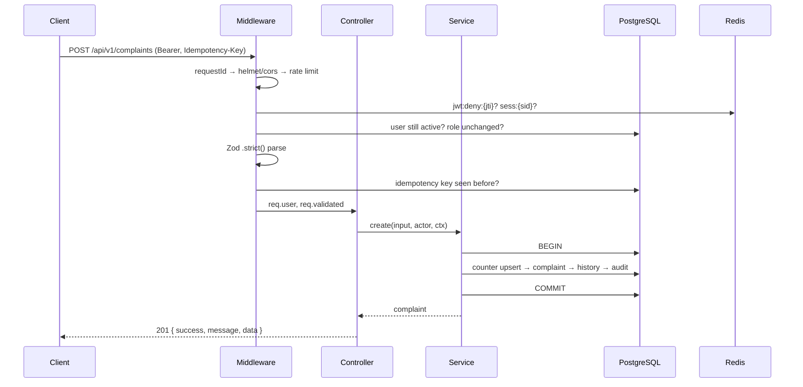

# Architecture

## Layers

```
Route  →  Middleware  →  Controller  →  Service  →  Prisma  →  PostgreSQL
```

Each layer has exactly one job, and the boundaries are enforced by convention everywhere in
`src/modules/`.

| Layer | Does | Never does |
| --- | --- | --- |
| **Route** | Wires a path to middleware and one controller function | Contain logic |
| **Middleware** | Rate limit, authenticate, authorise, validate, idempotency | Query business tables |
| **Controller** | Reads validated input, calls **one** service function, sends the response | Touch Prisma; branch on business rules; `try/catch` |
| **Service** | Business rules, ownership checks, transactions, audit, notifications | Touch `req` or `res` |
| **Prisma** | Typed data access with a soft-delete read filter | — |

A service receives a plain context object instead of the request:

```ts
type Ctx = { ip: string; ua: string; requestId?: string };
```

That is what makes services callable from a cron job, a test or a script — the SLA checker calls
`applyStatusChange()` with no HTTP request anywhere in sight.

## Request flow



## Cross-cutting pieces

| Concern | Where | Note |
| --- | --- | --- |
| Configuration | `src/config/env.ts` | The only file allowed to read `process.env`. Zod-validated; a missing key kills the process at boot |
| Correlation | `src/middlewares/requestId.ts` | `X-Request-Id` in, validated or minted, echoed back, attached to every log line and error body |
| Logging | `src/lib/logger.ts` | pino with a redaction list covering authorization headers, passwords, OTPs and tokens |
| Caching | `src/lib/cache.ts` | `cached(key, ttl, fn)` — a Redis failure silently falls through to the database |
| Settings | `src/lib/settings.ts` | Runtime knobs from `SystemSetting`, with in-code defaults and a 60 s memo |
| Errors | `src/middlewares/globalErrorHandler.ts` | Maps Zod, Prisma, JWT, Multer and `ApiError` onto the envelope. Production never sees a stack trace |
| Metrics | `src/lib/metrics.ts` | prom-client at `/metrics`, behind an ADMIN token |

## Consistency guarantees

**Optimistic locking.** Every status change filters on the status it expects to find:

```ts
const { count } = await tx.complaint.updateMany({
  where: { id, status: current.status, deletedAt: null },
  data: { status: next },
});
if (count === 0) throw new ApiError(409, "Complaint was modified by someone else");
```

Two concurrent requests produce one `200` and one `409` — never a lost update.

**One transaction per meaningful change.** The row, its history entry, the audit record and the
notification are written together or not at all. Email is deliberately *outside* the
transaction: a mail server hiccup must not roll back a resolved complaint.

**Idempotency.** `POST /complaints` and `POST /payments/initiate` accept an `Idempotency-Key`.
The same key with the same body replays the stored response; the same key with a different body
is `422 IDEMPOTENCY_MISMATCH`.

**Soft delete on read.** A Prisma client extension adds `deletedAt: null` to `findMany`,
`findFirst` and `count` for the seven models that carry the column, unless the caller passes
`deletedAt` explicitly — which is exactly how admin restore and the purge job reach deleted rows.

## Failure behaviour

| Dependency | If it is down |
| --- | --- |
| PostgreSQL | `/ready` answers 503; requests fail. It is the one hard dependency |
| Redis | The API keeps serving. Caches miss, rate limiting falls back to memory, session checks hit the database. Signup and login-OTP answer `503` because they genuinely need it |
| SMTP | Requests still succeed. The failure is recorded in `EmailLog` |
| Cloudinary | Only upload endpoints fail, with `503` |
| SSLCommerz | Only payment endpoints fail, with `502 GATEWAY_ERROR` |

## Graceful shutdown

On `SIGTERM`/`SIGINT` the server stops accepting connections, cron tasks stop, Prisma and Redis
disconnect, and the process exits — with a 10-second hard timeout so a stuck connection cannot
hold a deploy hostage. `headersTimeout` (15 s) and `requestTimeout` (30 s) stop slowloris-style
clients from parking sockets.
